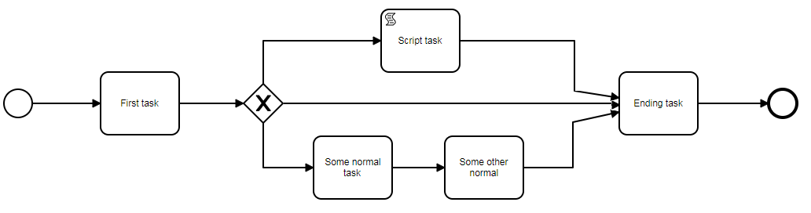

# Workflow

Kitodo.Production uses BPMN 2.0 diagrams as the template for the task sequence of a process. The diagram editor (see [Modeler](Modeler/README.md)) extends standard BPMN with Kitodo specific attributes in the namespace `http://www.kitodo.org/template` (declared as the `template` namespace).

* [Modeler](Modeler/README.md)
* [Diagram template processing](Diagram_template_processing/README.md)
* [Create process out of template](Template_process_creation/README.md)

## Example diagram

<figure>
  
  <figcaption>Example workflow</figcaption>
</figure>

An XML file representing an example workflow (the graphical shape information in the `bpmndi` section is omitted):

```xml
<?xml version="1.0" encoding="UTF-8"?>
<bpmn2:definitions xmlns:xsi="http://www.w3.org/2001/XMLSchema-instance"
                   xmlns:bpmn2="http://www.omg.org/spec/BPMN/20100524/MODEL"
                   xmlns:bpmndi="http://www.omg.org/spec/BPMN/20100524/DI"
                   xmlns:dc="http://www.omg.org/spec/DD/20100524/DC"
                   xmlns:di="http://www.omg.org/spec/DD/20100524/DI"
                   xmlns:template="http://www.kitodo.org/template" id="sample-diagram"
                   targetNamespace="http://bpmn.io/schema/bpmn"
                   xsi:schemaLocation="http://www.omg.org/spec/BPMN/20100524/MODEL BPMN20.xsd">
    <bpmn2:process id="Example_Workflow" name="Example_Workflow" isExecutable="false"
                   template:outputName="Example_Workflow">
        <bpmn2:startEvent id="StartEvent_1">
            <bpmn2:outgoing>SequenceFlow_05ujoyy</bpmn2:outgoing>
        </bpmn2:startEvent>
        <bpmn2:task id="Task_1" name="Scanning" template:priority="0" template:typeImagesRead="true"
                    template:typeImagesWrite="true" template:permittedUserRole="1,2">
            <bpmn2:incoming>SequenceFlow_05ujoyy</bpmn2:incoming>
            <bpmn2:outgoing>SequenceFlow_0np532x</bpmn2:outgoing>
        </bpmn2:task>
        <bpmn2:sequenceFlow id="SequenceFlow_05ujoyy" sourceRef="StartEvent_1" targetRef="Task_1"/>
        <bpmn2:task id="Task_2" name="QC" template:priority="0" template:typeImagesRead="true"
                    template:permittedUserRole="1,3">
            <bpmn2:incoming>SequenceFlow_0np532x</bpmn2:incoming>
            <bpmn2:outgoing>SequenceFlow_1803kdf</bpmn2:outgoing>
        </bpmn2:task>
        <bpmn2:sequenceFlow id="SequenceFlow_0np532x" sourceRef="Task_1" targetRef="Task_2"/>
        <bpmn2:task id="Task_3" name="Structure and Metadata" template:priority="0" template:typeMetadata="true"
                    template:permittedUserRole="1,5">
            <bpmn2:incoming>SequenceFlow_1803kdf</bpmn2:incoming>
            <bpmn2:outgoing>SequenceFlow_1sdich4</bpmn2:outgoing>
        </bpmn2:task>
        <bpmn2:sequenceFlow id="SequenceFlow_1803kdf" sourceRef="Task_2" targetRef="Task_3"/>
        <bpmn2:task id="Task_4" name="Export DMS" template:priority="0" template:typeExportDMS="true"
                    template:permittedUserRole="1,6">
            <bpmn2:incoming>SequenceFlow_1sdich4</bpmn2:incoming>
            <bpmn2:outgoing>SequenceFlow_0vxm9nz</bpmn2:outgoing>
        </bpmn2:task>
        <bpmn2:sequenceFlow id="SequenceFlow_1sdich4" sourceRef="Task_3" targetRef="Task_4"/>
        <bpmn2:endEvent id="EndEvent_1r20d3t">
            <bpmn2:incoming>SequenceFlow_0vxm9nz</bpmn2:incoming>
        </bpmn2:endEvent>
        <bpmn2:sequenceFlow id="SequenceFlow_0vxm9nz" sourceRef="Task_4" targetRef="EndEvent_1r20d3t"/>
    </bpmn2:process>
    <bpmndi:BPMNDiagram id="BPMNDiagram_1">
        non relevant shape information
    </bpmndi:BPMNDiagram>
</bpmn2:definitions>
```

Tasks that are only part of a conditional branch (behind a gateway) carry the condition attributes, for example:

```xml
<bpmn2:task id="Task4" name="Task4" template:permittedUserRole="1,2"
            template:kitodoConditionType="XPath"
            template:kitodoConditionValue="/mets:mets/mets:dmdSec/mets:mdWrap/mets:xmlData/kitodo:kitodo"/>
```

A complete, ready-to-use example diagram is shipped in [`Kitodo/diagrams/Example_Workflow.bpmn20.xml`](https://github.com/kitodo/kitodo-production/blob/main/Kitodo/diagrams/Example_Workflow.bpmn20.xml).
